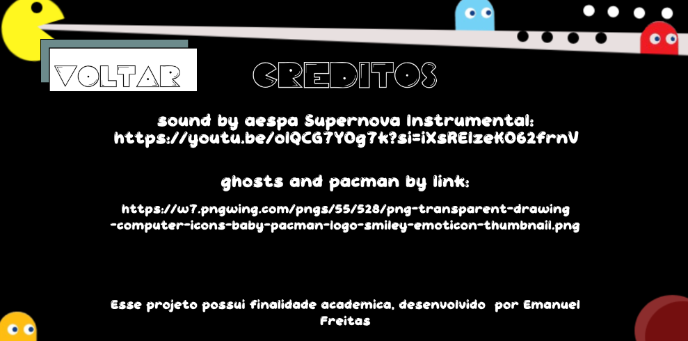
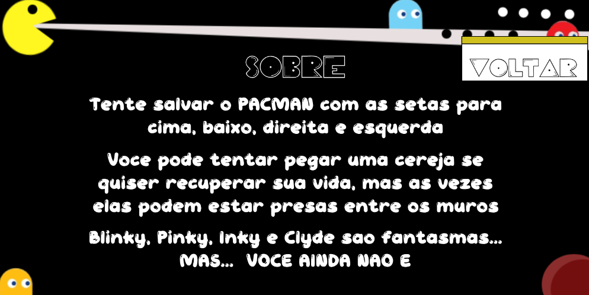
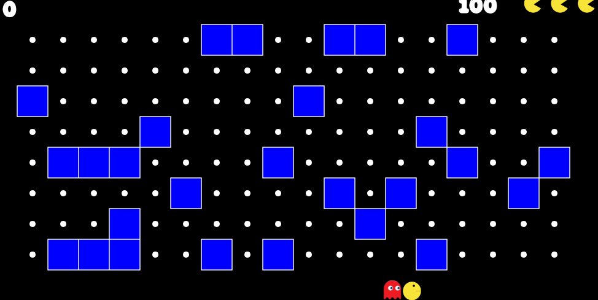

# pacman
Este projeto consiste na criação de uma versão interativa do clássico jogo Pac-Man, desenvolvida utilizando JavaScript, HTML e CSS, como parte da disciplina Matemática Aplicada à Multimídia no curso de Sistemas e Mídias Digitais da Universidade Federal do Ceará (UFC).

### Tela de Início  
A interface inicial do jogo

### Tela de Créditos  
Ferramentas utilizadas no desenvolvimento. Os direitos autorais são dos seus respectivos donos

### Tela Sobre   

### Tela do Jogo  
Visualização do jogo 

## Relatorio
[link relatorio](https://drive.google.com/file/d/1EFZz2hdRjgKGx7TV_L0NmLMD_kQD5vyI/view?usp=sharing)

## link Youtube
[link video](https://youtu.be/fh-dHhiUCFQ?si=-NlwfjacgerB5tZE).
