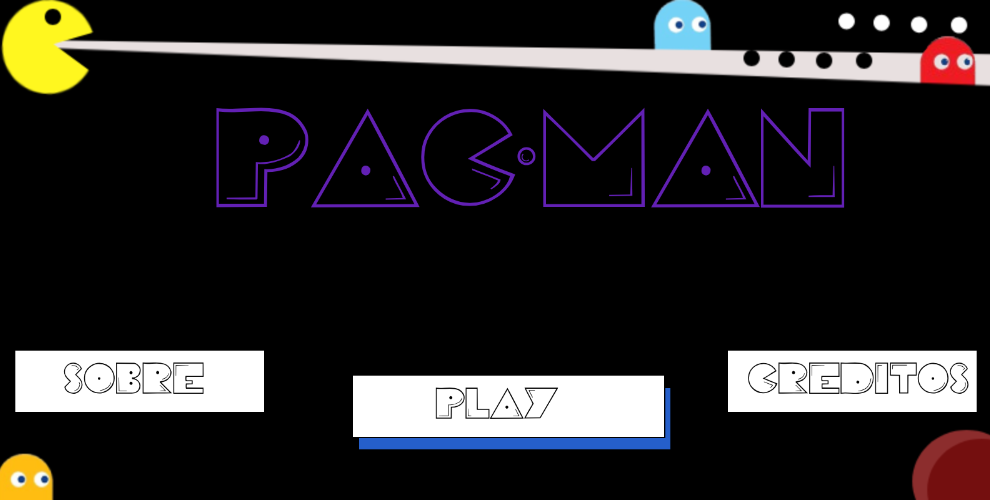

# pacman
Este projeto consiste na criação de uma versão interativa do clássico jogo Pac-Man, desenvolvida utilizando JavaScript, HTML e CSS, como parte da disciplina Matemática Aplicada à Multimídia no curso de Sistemas e Mídias Digitais da Universidade Federal do Ceará (UFC).

## Demonstração do Jogo

